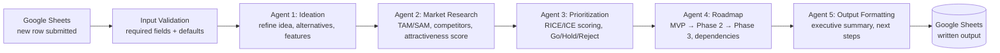

<div align="center">

# 🧠 Idea → PRD — 5-Agent Product Management Pipeline (n8n)

### A raw one-line idea goes in; a scored, roadmapped, executive Go/No-Go recommendation comes out — fully automated, five specialized agents deep


**[⬇️ Download Workflow](assets/product-managers-super-agent.json) · [✍️ Original Prompts](prompts/)**

</div>

---

## TL;DR

Most "AI does my PM work" demos are one prompt pretending to do five jobs. This is the opposite: **five separate, specialized agents**, each doing one real PM function — ideation, market research, prioritization, roadmapping, executive summary — where each agent's output becomes the next agent's structured input, ending in a written-to-Google-Sheets Go/No-Go recommendation a stakeholder could actually act on.

**My role:** designed the 5-agent architecture, wrote every agent's prompt and output schema, and built the validation/parsing logic connecting them.

---

## 📖 Table of Contents

- [The Problem](#-the-problem)
- [The 5-Agent Pipeline](#-the-5-agent-pipeline)
- [Temperature, Tuned Per Agent](#️-temperature-tuned-per-agent)
- [The Scoring Formula](#-the-scoring-formula)
- [Data Validation, Not Just Prompting](#-data-validation-not-just-prompting)
- [See It in Action](#-see-it-in-action)
- [Design Decisions That Mattered](#-design-decisions-that-mattered)
- [What This Demonstrates](#-what-this-demonstrates)

---

## 🔍 The Problem

Taking a raw product idea to a decision-ready recommendation normally means a PM doing ideation, competitive research, prioritization scoring, and roadmap planning as four separate, manual passes — usually over days. This workflow compresses that into one automated pipeline: submit an idea via a Google Sheet row, and every stage runs in sequence without manual handoff between them.

---

## ⚙️ The 5-Agent Pipeline



Every arrow above is a real data dependency, not just a sequence — Agent 2 receives Agent 1's `refined_idea` and `key_features` by name; Agent 3 receives Agent 2's `attractiveness_score` and `market_summary`; Agent 4 receives Agent 3's `effort_required` and `risk_level`; Agent 5 receives fields from all four prior agents. This is what makes it a genuine pipeline rather than five independent prompts run on the same input.

**Full verbatim prompt + design rationale for each agent:**

| Agent | Job | Prompt |
|---|---|---|
| 1. Ideation | Refines raw idea, generates alternatives, extracts core problems & features | [`01-ideation-agent-prompt.md`](prompts/01-ideation-agent-prompt.md) |
| 2. Market Research | TAM/SAM sizing, competitor analysis, market attractiveness score | [`02-market-research-agent-prompt.md`](prompts/02-market-research-agent-prompt.md) |
| 3. Prioritization | RICE/ICE-style scoring, Go/Hold/Reject recommendation | [`03-prioritization-agent-prompt.md`](prompts/03-prioritization-agent-prompt.md) |
| 4. Roadmap | MVP/Phase 2/Phase 3 breakdown, dependencies, team requirements | [`04-roadmap-agent-prompt.md`](prompts/04-roadmap-agent-prompt.md) |
| 5. Output Formatting | Executive summary, business case, next steps with owners | [`05-output-formatting-agent-prompt.md`](prompts/05-output-formatting-agent-prompt.md) |

---

## 🌡️ Temperature, Tuned Per Agent

Pulling the real workflow file apart revealed something the setup documentation never mentioned: **each of the 5 agents runs at its own, deliberately different temperature** — not one setting reused everywhere.

| Agent | Temperature | Why |
|---|---|---|
| 1. Ideation | **0.7** | Highest on purpose — generating genuinely different alternative concepts needs room to vary, not the same idea reworded |
| 2. Market Research | **0.3** | Lower — market sizing and competitor analysis should stay grounded, not creatively embellished |
| 3. Prioritization | **0.2** | Lowest of all five — this agent is effectively doing scoring arithmetic dressed as prose; consistency matters more here than anywhere else in the pipeline |
| 4. Roadmap | **0.4** | Slightly higher again — sequencing and phasing benefit from some flexibility in how a plan gets structured |
| 5. Output Formatting | **0.3** | Back down — an executive summary needs to be decisive and consistent, not creatively varied between runs |

The Prioritization Agent sitting at the lowest temperature of the whole pipeline isn't incidental — it's the one agent whose output (`calculated_score`) other logic downstream treats as a number to threshold against (High/Medium/Low tiers). Letting that specific agent run "creative" would make the same idea score differently on different runs, which would break the whole point of having a repeatable scoring formula.

---

## 🎯 The Scoring Formula

The Prioritization Agent doesn't leave scoring to holistic AI judgment — it's handed an explicit equation to apply:

```
Priority Score = (Business Value + User Impact + Market Timing + Strategic Fit)
                 − (Effort Required + Risk Level)

High  (15+):  Immediate execution recommended
Medium (8-14): Consider for next planning cycle
Low   (<8):    Revisit when constraints change
```

Each of the 6 inputs is scored 1-10 by the agent itself, but **Effort Required and Risk Level are explicitly inverted** (10 = low effort/risk) in the prompt — a detail that, if missed, would silently flip the entire priority ranking. The formula, not a vague "how good does this feel," is what produces `calculated_score` — making every recommendation traceable back to six specific numbers instead of an opaque verdict.

---

## 🛡 Data Validation, Not Just Prompting

Every agent's JSON output is parsed through a dedicated code node before being passed to the next agent — not trusted as-is:

```javascript
// From the Market Research parsing node
const requiredFields = ['market_size', 'competitors', 'attractiveness_score', 'market_summary'];
for (const field of requiredFields) {
    if (!marketResult[field]) throw new Error(`Missing required field: ${field}`);
}

// Defensive type coercion — never let a malformed array break downstream nodes
if (!Array.isArray(marketResult.competitors)) marketResult.competitors = [];

// Range-clamp instead of trusting the model's number
if (marketResult.attractiveness_score < 1 || marketResult.attractiveness_score > 10) {
    marketResult.attractiveness_score = 5; // safe default, not a crash
}
```

This pattern repeats at every stage: strip markdown code fences, validate required fields exist, coerce arrays defensively, clamp out-of-range scores to a safe default rather than letting a malformed value propagate silently into the next agent's prompt. **Worth being precise about what this is and isn't:** this is input/output validation on the response content, not a confirmed multi-provider fallback. One thing visible in the raw workflow file that I want to flag honestly rather than overclaim: each of the 5 agent nodes is wired to *two* separate Gemini model connections (one fully configured with an explicit model + temperature, one left at defaults) — which may reflect n8n's built-in primary/fallback model input on Agent nodes, but I haven't been able to confirm that's what's actually configured here versus a leftover from duplicating agent blocks during the build. Unlike my [Morning Digest](https://github.com/Rehansheikh787/Daily-Morning-Digest-news) or [RupeeRadar](https://github.com/Rehansheikh787/Rupee-Radar-) projects, I'm not claiming a confirmed cross-provider fallback here — if Gemini itself is unreachable, I can't verify from the file alone whether this pipeline degrades gracefully or fails outright.

---

## 🎬 See It in Action

A real idea submitted via Google Sheets, run through all 5 agents end to end:

<p align="center">

</p>

<p align="center"><sub><a href="assets/idea-to-prd-demo-full.mp4">▶️ Full-length version (idea-to-prd-demo-full.mp4)</a></sub></p>

---

## 🎯 Design Decisions That Mattered

- **Explicit node references, not just field names** — the deeper into the chain an agent sits, the more of its context has to reach back to a *specific named node* (`{{ $('Parse Market Research').item.json.marketResult... }}`) rather than plain `{{$json...}}`, because n8n's `$json` only ever resolves to the immediately preceding node. By Agent 5, nearly every context field names its source explicitly — Agent 1's output, Agent 2's output, Agent 3's output, each pulled from a different specifically-named upstream node. This is what makes a 5-stage chain's data flow actually traceable, not just conceptually chained.
- **Consistent 1-10 scoring scales across agents** — market attractiveness, business value, user impact, and risk all use the same scale, which is what makes cross-agent arithmetic (like the priority formula) mathematically coherent instead of mixing incompatible units.
- **A given formula beats a requested judgment** — handing the Prioritization Agent the literal scoring equation, rather than asking it to "prioritize holistically," is what makes `calculated_score` reproducible and explainable rather than a black-box number that shifts between runs.
- **The last agent is a synthesizer, deliberately fed less than everything** — Agent 5 receives a curated subset of fields from the prior four agents, not their full JSON dumps, forcing an actual executive summary rather than a re-paste of everything already generated.
- **Validation as a separate step from generation** — every agent's raw output passes through its own code node before being trusted. Catching a missing field or an out-of-range score immediately after generation is cheaper and clearer than letting it silently corrupt three more agent calls downstream.

---

## 🎓 What This Demonstrates

- **Decomposing a fuzzy PM workflow into discrete, chainable agent responsibilities** — ideation, research, prioritization, roadmapping, and communication are genuinely different skills, and treating them as five specialized agents (rather than one mega-prompt) mirrors how a real cross-functional review actually works
- **Designing prioritization as an explicit, auditable formula** — not just asking an LLM to "rank these," but handing it the exact arithmetic and being precise about which variables are inverted
- **Defensive parsing at every handoff** — validating, coercing, and clamping each agent's output before it becomes another agent's input, so a malformed response degrades gracefully instead of corrupting the whole downstream chain
- **Being precise about what's confirmed vs. uncertain from the raw file** — the response-validation pattern (required fields, type coercion, score clamping) is confirmed and consistent across all 5 agents; the dual-model wiring's exact purpose (fallback vs. leftover from duplicating blocks) isn't something I could verify with certainty from the JSON alone, and saying so directly is more useful than guessing confidently either way


---

<div align="center">

I'm a **Chemical Engineer transitioning into AI Product Management**, and I build hands-on with agentic workflow tools to understand the real design tradeoffs behind multi-step AI systems.

📂 More case studies and projects on my [GitHub profile](https://github.com/Rehansheikh787).

</div>
